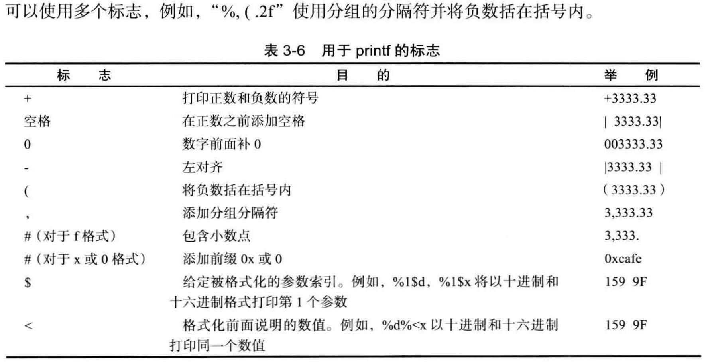
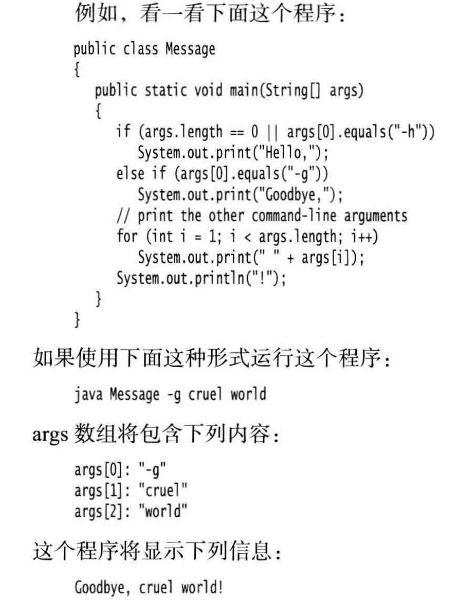

变量一定要显式初始化

常量声明用final，一般常量全大写。

变量名一定字母开头且不能有空格。

类常量在main外面，整个类内的函数都能用。

强制类型转换的语法格式是

在圆括号中给出想要转换的目标类型，后面紧跟待转换的变量名。

Math.rount(double)

Math.pow(double,double)

数据类型(这个之前没注意一共有8种类型，4种整型，2种浮点类型，1种Unicode编码的字符单元的字符类型char,
一种是表示真假的Boolean)转换是优先级是double>float>long>int

如果运算符得到一个值，其类型与左侧操作数的类型不同，就会发生强制类型转换。例如，如果x是一个int，则以下的语句
`x += 3.5;`
是合法的,将把x设置为`(int)(x + 3.5)`

因为+=是右结合运算符，所以表达式`a+=b+=c`等价于`a+=（b+=c）`

切子串包左不包右，
```
String greeting = "Hello";
String s = greeting.substring(1,3) ;
```
这种切割语法的好处是可以迅速知道去了几个字符直接就是`String.substring(a,b)`b-a个字符

检测字符串是否相等用的是equals
可以是字符串变量也可以是字符串字面量
"Hello".equals(greeting)
要想检测两个字符串是否相等，而不区分大小写， 可以使用equalsIgnoreCase 方法。
一定不要使用=运算符检测两个字符串是否相等！ 这个运算符只能够确定两个字串是否放置在同一个位置上。
空串是一个java对象，有自己的串长度（0）和内容（空）
```
if (str.length() == 0)

if (str.equals(""))
```
字符串变量还可以存放一个特殊的值，名为null，检查一个字符串是否为null，`if (str == null)`

`str.compareTo("str1")`
//如果第一个字符和参数的第一个字符不等，结束比较，返回第一个字符的ASCII码差值。
// 如果第一个字符和参数的第一个字符相等，则以第二个字符和参数的第二个字符做比较，以此类推，直至不等为止，
返回该字符的ASCII码差值。如果两个字符串不一样长，可对应字符又完全一样，则返回两个字符串的长度差值。

`int indexOf (String str, int fromlndex)`
最终返回的int和fromindex没关系都是从头开始计算的，只不过用fromindex可以少查一些点。




for-each循环要会用，这是JAVA特意增加的功能。编程效率比较高，不用下标
`for (variable : collection) statement`
```
for (int element : a)
System.out.println(element) :
```

数组复制
一是两个变量指向一个数组
```
int[] luckyNumbers = smallPrimes;
luckyNumbers[S] = 12; // now smallPrimes[5] is also 12
```

二是两个变量两个数组，复制地址内容
```
int[] copiedLuckyNumbers = Arrays.copyOf(luckyNumbers, luckyNumbers.length);
```
用Array.copyof方法，第二个参数是新数组的长度。比原数组长就补零，短就截取原数组前几位。

命令行参数，每一个Java 应用程序都有一个带String arg[]参数的main 方法。
这个参数表明main 方法将接收一个字符串数组， 也就是命令行参数。

在Java 应用程序的main 方法中， 程序名并没有存储在args 数组中
例如, 当使用下列命令运行程序时
java Message -h world
args[0] 是“ -h”， 而不是“ Message” 或“ java”。

对象与类
Object-oriented programming (OOP)
类与类之间的关系
依赖(uses-a)
聚合(has-a)
继承(is-a)

构造器的名字应该与类名相同。因此Date 类的构造器名为Date。要想构造一个Date对象，
需要在构造器前面加上new操作符，如下所示：

new Date()

这个表达式构造了一个新对象。
`Date birthday = new Date();`

要注意这里birthday不是对象，而是对象变量，对象变量只是引用对象，并不是对象。

更改器方法和访问器方法。

更改器方法，访问并修改对象。

访问器方法，访问但不修改对象，例如String类的toUpperCase.
只是返回大写的字符串，但是没有修改对象

示例程序中包含两个类：Employee类和带有public访问修饰符的EmployeeTest类。 EmployeeTest类包含了main方法，其中使用了前面介绍的指令。

源文件名是EmployeeTest.java，这是因为文件名必须与public类的名字相匹配。在一个源文件中，只能有一个公有类，但可以有任意数目的非公有类。

构造器总是伴随着new操作符的执行被调用，
而不能对一个已经存在的对象调用构造器来达到重新设置实例域的目的。

•构造器与类同名
•每个类可以有一个以上的构造器
•构造器可以有0 个、1 个或多个参数
•构造器没有返回值
•构造器总是伴随着new 操作一起调用


对象的内存解析


JVM主要讲这部分，
关键是虚拟机栈、堆、方法区
堆heap 主要存放对象实例

栈  stack用于存储局部变量

方法区  存放类信息、变量、静态域

for example

//常见person类对象

Person p1 = new Person();

Person p2 = new Person();

Person p3 = p1; //这个并不是新创建对象是新声明变量

对p3修改就是对p1修改

//调用属性

p1.name = "tom";

p1.isMale = true;

//调用方法

p1.print();

p1.sleep();

p1.eat();

p1.talk("Chinese");


